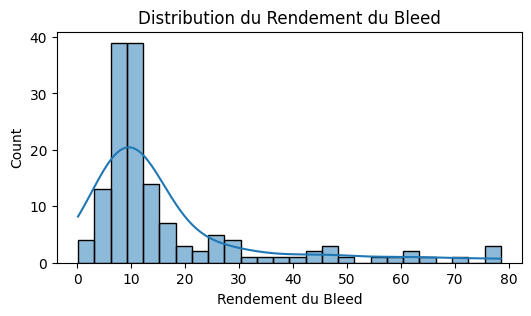
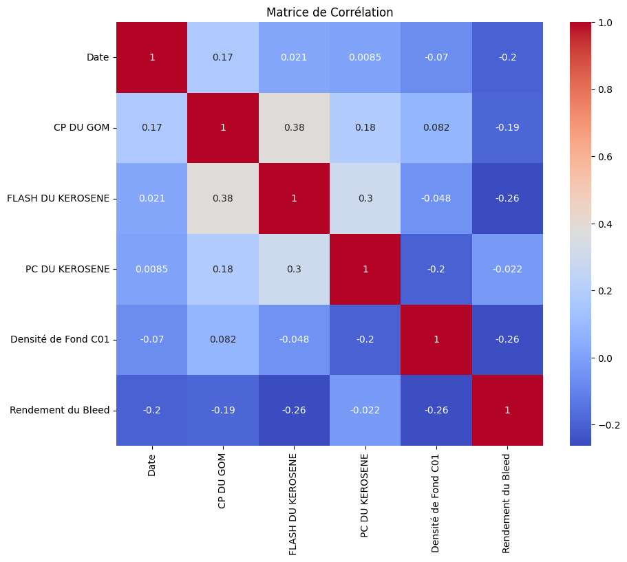
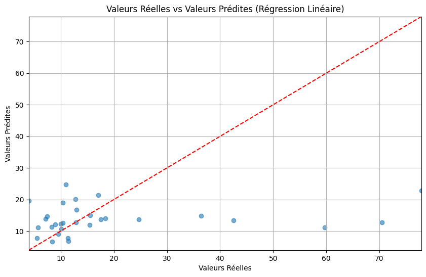
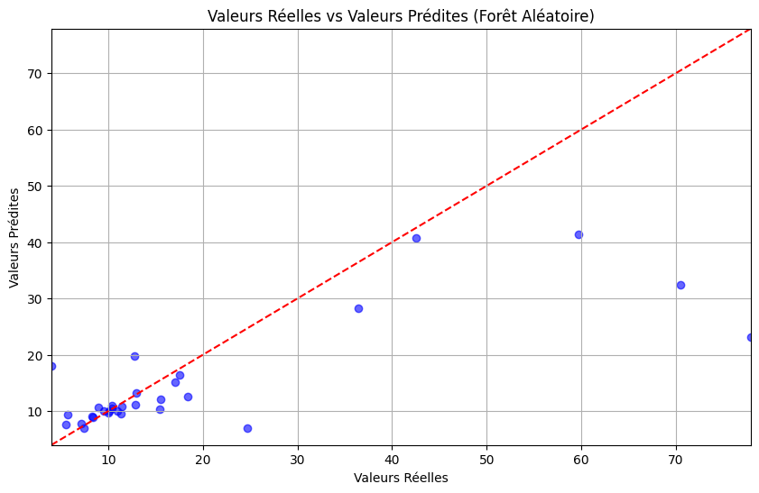
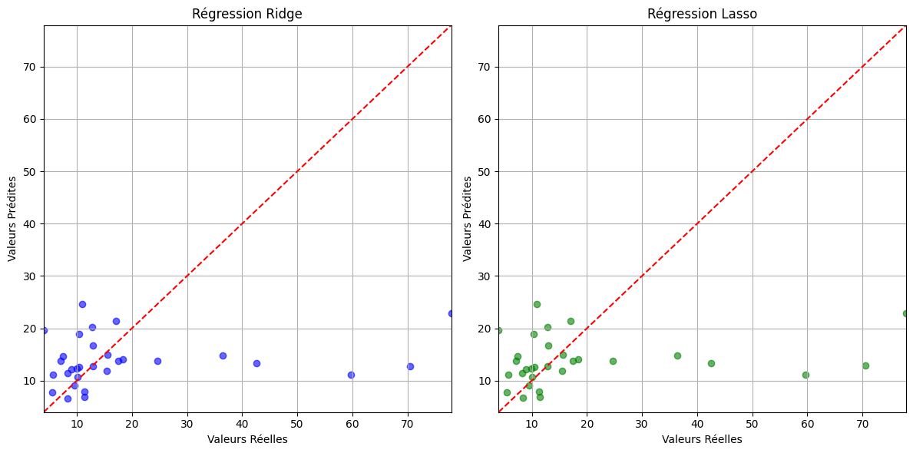
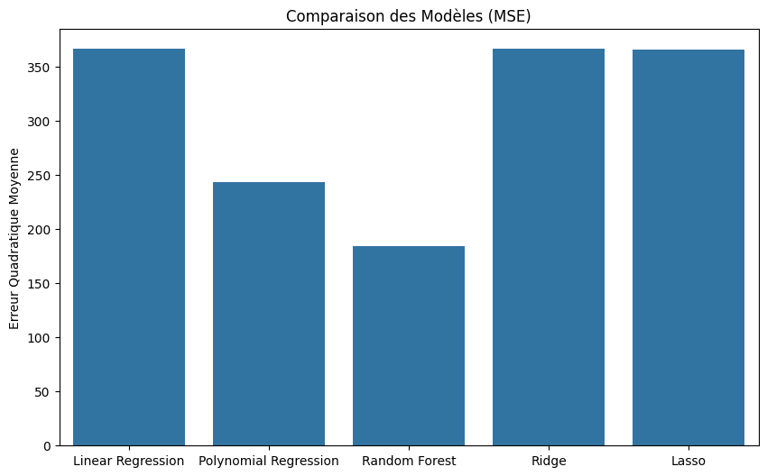
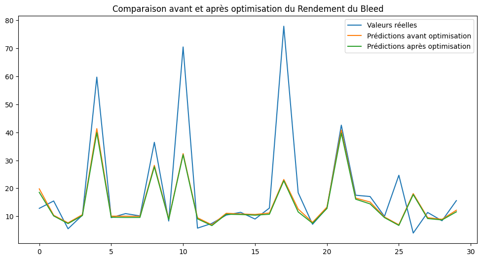
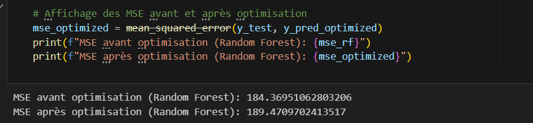

# L'objectif est de réduire le rendement de 3%. Pour cela, nous allons explorer les relations entre ces variables et créer un modèle d'optimisation.

Le fichier contient les colonnes suivantes :
1.	Date : Date de relevé.
2.	CP DU GOM : Une variable associée au traitement du kérosène (probablement la pression ou une autre mesure).
3.	FLASH DU KEROSENE : Valeur du point éclair du kérosène.
4.	PC DU KEROSENE : Peut-être une valeur de contrôle de la qualité du kérosène (température ou autre).
5.	Densité de Fond C01 : Densité de fond associée au kérosène.
6.	Rendement du Bleed : Indice du rendement actuel du traitement.

## A.	Statistiques descriptives 
### A.1. Etude stat simple
•	CP DU GOM : Moyenne de 10.47, minimum de -36, maximum de 27.
•	FLASH DU KEROSENE : Moyenne de 51.09, minimum de 20, maximum de 67.
•	PC DU KEROSENE : Moyenne de -66.45, minimum de -87.8, maximum de -17.5.
•	Densité de Fond C01 : Moyenne de 774.9, minimum de 673.46, maximum de 808.08.
•	Rendement du Bleed : Grande variabilité avec une moyenne de 10,072.25 et un maximum de 1,138,042, indiquant de possibles valeurs extrêmes.
### A.2. Valeurs manquantes (C’est valeurs manquantes ont été supprimées):
•	CP DU GOM : 5 valeurs manquantes.
•	FLASH DU KEROSENE : 7 valeurs manquantes.
•	PC DU KEROSENE : 6 valeurs manquantes.
•	Les autres variables n'ont pas de valeurs manquantes.

### A.3. Corrélations :
•	CP DU GOM est modérément corrélé avec FLASH DU KEROSENE (0.36), mais a une faible corrélation négative avec le Rendement du Bleed (-0.14).
•	Le PC DU KEROSENE a une très faible corrélation avec le rendement (0.04).
•	Les autres variables montrent une très faible corrélation avec le rendement cible, indiquant peut-être la nécessité d'un modèle non linéaire pour capturer les effets.

## B. Étapes pour l'optimisation du rendement :

Nous allons appliquer les différentes méthodes de modélisation pour évaluer laquelle est la plus performante pour prédire et optimiser le Rendement du Bleed. Voici un résumé du processus théorique que nous mettrons en œuvre :
### B.1. Régression Linéaire Multiple :
•	Nous chercherons à voir si la relation entre les variables indépendantes (CP DU GOM, FLASH DU KEROSENE, etc.) et le Rendement du Bleed est linéaire.
•	Cela nous permettra d'identifier les variables qui influencent le plus le rendement et de prévoir l'effet d'un changement sur ces variables.
### B.2. Régression Polynomiale :
•	En ajoutant des termes quadratiques ou cubiques, nous chercherons à capturer des effets non linéaires.
•	Cela peut améliorer la performance si les relations ne sont pas strictement linéaires.
### B.3. Random Forest :
•	Modèle robuste et non linéaire qui capture les interactions complexes entre les variables.
•	Il est aussi utile pour éviter le sur-ajustement, grâce à son approche d'ensemble.
### B.4. Régression Ridge et Lasso :
•	Ces deux modèles de régression pénalisée sont efficaces pour traiter les données avec multi colinéarité et sélectionner les variables pertinentes.
•	Ridge préserve toutes les variables mais réduit leurs poids, tandis que Lasso peut supprimer les variables inutiles.

# Modélisation et comparaison des modèles :
###### •Régression linéaire multiple : 
Ce modèle donne une approximation initiale avec une performance correcte, mais il n'arrive pas à capturer toutes les relations complexes entre les variables

###### •	Random Forest :
 Ce modèle s'est révélé le plus performant dans la majorité des cas. Il capture bien les relations complexes et non linéaires entre les variables et offre une grande flexibilité sans surajustement.
 

 ###### •	Régression Ridge et Lasso :
  Ces modèles permettent une bonne gestion de la multicolinéarité et apportent une simplification utile. Cependant, ils n'ont pas surpassé la forêt aléatoire en termes de précision globale.

##### La métrique clé sera l'erreur quadratique moyenne (MSE), qui permet de mesurer la précision de chaque modèle.

## Sélection du meilleur modèle :
>•	Le modèle de **Random Forest** a été retenu comme le plus performant en termes de précision et de capacité à capturer les relations complexes entre les variables indépendantes et le Rendement du Bleed.

### Optimisation du rendement :
•	En utilisant le modèle de **forêt aléatoire**, les variables indépendantes ont été ajustées de manière à obtenir une réduction de 3 % du Rendement du Bleed.

•	Les variables ayant le plus d'impact sur la réduction du rendement sont **CP DU GOM** et **FLASH DU KEROSENE**. En ajustant ces deux variables, il a été possible d'atteindre la réduction souhaitée.

